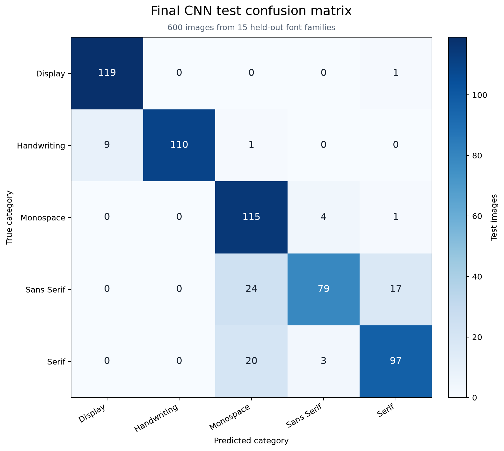
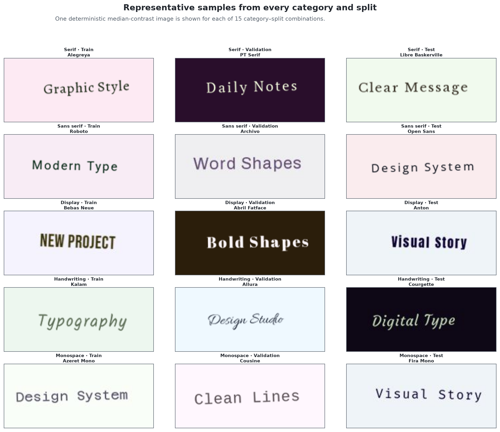

# FontSense — Broad Font Category Classification

FontSense is a computer-vision project that accepts a cropped image containing
Latin text and predicts one of five broad font categories:

- Display
- Handwriting
- Monospace
- Sans serif
- Serif

**FontSense predicts broad font categories. It does not identify the exact font
family or font style.**

## Table of contents

- [Demo](#demo)
- [Project motivation](#project-motivation)
- [Student and project information](#student-and-project-information)
- [Current project state](#current-project-state)
- [Final held-out test results](#final-held-out-test-results)
- [Model comparison](#model-comparison)
- [Uncertainty handling](#uncertainty-handling)
- [Dataset](#dataset)
- [Leakage-safe family split](#leakage-safe-family-split)
- [Selected CNN](#selected-cnn)
- [Preprocessing](#preprocessing)
- [Gradio application](#gradio-application)
- [EDA and Data Gate](#eda-and-data-gate)
- [Reports and reproducibility](#reports-and-reproducibility)
- [Intended use and limitations](#intended-use-and-limitations)
- [Academic integrity and AI assistance](#academic-integrity-and-ai-assistance)
- [Licence and attribution](#licence-and-attribution)

## Demo

[](https://colab.research.google.com/github/rustamovalixan04-cyber/fontsense/blob/main/notebooks/07_colab_demo.ipynb)

- **Google Colab:** [`notebooks/07_colab_demo.ipynb`](notebooks/07_colab_demo.ipynb)
- **Local Gradio application:** [`app.py`](app.py)
- **Vercel deployment guide:** [`docs/deployment_vercel.md`](docs/deployment_vercel.md)

The Colab notebook loads the same frozen CNN checkpoint and launches the same
Gradio interface as the local application. A Colab Gradio share link is
temporary: closing or disconnecting the runtime stops the app. The repository
is public, and the student manually tested the notebook successfully after it
became public. The local Gradio application has also been launched and checked.

## Project motivation

Designers often receive screenshots, posters, or flattened artwork without the
original font information. Recognising the broad category first can narrow the
search for a similar font. FontSense studies a stricter version of this task:
can a model trained on some font families classify images from completely
unseen families? This is broad-category classification, not exact font
identification.

## Student and project information

| Item | Details |
|---|---|
| Student | Rustamov Alixan |
| Project | AI/ML Fundamentals Capstone |
| Task | Multiclass computer-vision classification |
| Interface | Gradio |
| Experiment tracking | MLflow |
| Models | Majority baseline; HOG + multinomial Logistic Regression; small CNN |

The original scope is recorded in the
[`FontSense project brief`](docs/FontSense_Project_Brief_Rustamov_Alixan.docx).

## Current project state

The assessed ML pipeline, held-out evaluation, Gradio app, Colab demo, automated
tests, CI, M8C3 Data Gate evidence, and final project documentation are
complete. The EXTC0 no-partner Peer QA route is recorded in
[`docs/extc0_peer_qa_review.md`](docs/extc0_peer_qa_review.md).

EXTC1 is still in progress. Its specification work has reached the real-review
gate, but exactly two genuine reviewer or mentor comments, the owner's
decisions, an approved first task, and a Green Specification Gate are still
required. No Windows EXE has been implemented or claimed. See
[`PROJECT_STATUS.md`](PROJECT_STATUS.md) for the current boundary and
[`docs/defense_prep.md`](docs/defense_prep.md) for presentation preparation.

## Final held-out test results

The selected CNN was evaluated once on the complete held-out test split after
the checkpoint, preprocessing, class order, model choice, and uncertainty
threshold had been frozen. Test results were not used to tune the model.

| Metric | Result |
|---|---:|
| Test images | 600 |
| Test font families | 15 |
| Macro F1 | **0.8653** |
| Accuracy | **86.67%** |
| Correct predictions | 520 |
| Incorrect predictions | 80 |
| Inference time | 7.66 ms per image |
| Model size | 255,505 bytes |

### Per-class test results

| Class | Precision | Recall | F1 |
|---|---:|---:|---:|
| Display | 0.930 | 0.992 | 0.960 |
| Handwriting | 1.000 | 0.917 | 0.957 |
| Monospace | 0.719 | 0.958 | 0.821 |
| Sans serif | 0.919 | 0.658 | 0.767 |
| Serif | 0.836 | 0.808 | 0.822 |

Sans serif was the weakest evaluated category, with **65.83% recall**. The
most common errors were:

- sans serif → monospace: 24
- serif → monospace: 20
- sans serif → serif: 17
- handwriting → display: 9



Sources:
[`final_test_metrics.json`](reports/final_evaluation/final_test_metrics.json),
[`final_classification_report.csv`](reports/final_evaluation/final_classification_report.csv),
and
[`errors_by_true_and_predicted.csv`](reports/final_evaluation/errors_by_true_and_predicted.csv).

## Model comparison

All model choices were made with validation data. The untouched test split was
not used for model selection.

| Model | Validation macro F1 | Validation accuracy |
|---|---:|---:|
| Majority baseline | 0.0667 | 20.0% |
| HOG + Logistic Regression | 0.6933 | 69.5% |
| Selected CNN | **0.8331** | **83.5%** |

The majority model was a basic sanity check. HOG supplied a useful classical
computer-vision baseline by describing edge and stroke directions, while
multinomial Logistic Regression returned five class probabilities. The CNN
learned richer spatial features directly from images and achieved the highest
validation macro F1, so it was selected for the final test.

The saved validation evidence is in
[`reports/baseline/`](reports/baseline/) and
[`reports/cnn/`](reports/cnn/). MLflow run identifiers and parameters are
exported in
[`reports/baseline/mlflow_runs.csv`](reports/baseline/mlflow_runs.csv) and
[`reports/cnn/mlflow_runs.csv`](reports/cnn/mlflow_runs.csv).

## Uncertainty handling

The frozen confidence threshold is **0.60** and was selected using validation
predictions only.

| Test uncertainty result | Value |
|---|---:|
| Accepted predictions | 454 |
| Uncertain predictions | 146 |
| Accepted-prediction accuracy | 92.51% |
| Confident mistakes | 34 |
| Low-confidence mistakes | 46 |
| Median test confidence | 83.93% |

A top probability at or above 0.60 is shown as an accepted prediction. A lower
probability is shown as an uncertain first guess. The threshold changes only
the accepted/uncertain label; it does not change the model probabilities or
predicted class. High confidence does not guarantee correctness. For example,
the strongest recorded confident mistake predicted Libre Baskerville as
monospace instead of serif with 94.81% confidence.

Sources:
[`pre_test_freeze.json`](reports/final_evaluation/pre_test_freeze.json),
[`confidence_distribution.csv`](reports/final_evaluation/confidence_distribution.csv),
and
[`confident_mistakes.csv`](reports/final_evaluation/confident_mistakes.csv).

## Dataset

The dataset was rendered from legally usable font files and official metadata
in the [Google Fonts repository](https://github.com/google/fonts). Font source,
licence, Latin support, and validation status are recorded per family.

| Dataset property | Value |
|---|---:|
| Selected font families | 90 |
| Categories | 5 |
| Images per family | 40 |
| Total images | 3,600 |
| Train images / families | 2,400 / 60 |
| Validation images / families | 600 / 15 |
| Test images / families | 600 / 15 |
| Generated source image size | 224 × 96 |
| CNN input | 112 × 48 grayscale |
| Random seed | 42 |

Each image contains a rendered Latin word or short phrase. The generator adds
controlled light and dark backgrounds, position and scale variation, mild
rotation, mild blur, optional mild JPEG compression, and small spacing and
contrast changes. The effect schedule was applied independently of category so
that effects or backgrounds did not reveal the label.

The full manifest records image path, category, font family, split, rendered
text, source font, seed, image size, and applied effects. The 3,600 generated
images may be ignored by Git because of their size, but they can be recreated
from the frozen split, configuration, and generator. Do not recreate the split
when reproducing the assessed dataset.

- [Dataset documentation](data/README.md)
- [Generation configuration](config/full_dataset.json)
- [Full image manifest](reports/dataset/full_manifest.csv)
- [Frozen family split](data/interim/google_fonts_final_family_split.csv)
- [Generation validation](reports/dataset/full_validation_summary.json)



## Leakage-safe family split

The **font family** is the grouping boundary. A family appears in only one of
train, validation, or test, and the family split was frozen before full image
generation. Verified overlap is zero:

- 60 training families
- 15 validation families
- 15 test families

No test image was used for training, validation, early stopping, model
selection, or threshold selection. Family names, paths, rendered text, source
fonts, generation effects, and split metadata were excluded from model
features. The category label was the training target, never an input feature.

This is stricter than randomly splitting rendered images. An image-level split
could put the same font family on both sides and allow the model to memorise
family-specific shapes. The family-level split instead measures generalisation
to unseen font families.

Evidence:
[`google_fonts_final_family_split.csv`](data/interim/google_fonts_final_family_split.csv),
[`pre_test_freeze.json`](reports/final_evaluation/pre_test_freeze.json), and
[`data_audit.md`](docs/data_audit.md).

## Selected CNN

The selected **Reference small CNN** uses:

- grayscale input at 112 × 48 pixels;
- 16 base convolution filters;
- dropout of 0.25;
- learning rate of 0.001;
- fixed seed 42;
- mild training-only augmentation;
- early stopping using validation macro F1;
- five output probabilities in the frozen class order.

The implementation has four convolutional layers with batch normalisation and
ReLU activations, pooling to reduce spatial size, adaptive average pooling, and
a dropout-plus-linear classifier. The best checkpoint was saved at epoch 14
using validation macro F1, not test performance.

- **Checkpoint:** [`artifacts/cnn/cnn_model.pt`](artifacts/cnn/cnn_model.pt)
- **SHA-256:** `c98cf0d1a02503a02b8f8242fec462ea2a0c455380238ec54fc4f62fdb13bb2f`
- **Model implementation:** [`src/fontsense/cnn_model.py`](src/fontsense/cnn_model.py)
- **Training implementation:** [`src/fontsense/train_cnn.py`](src/fontsense/train_cnn.py)
- **Saved metadata:** [`artifacts/cnn/cnn_metadata.json`](artifacts/cnn/cnn_metadata.json)

The Gradio app verifies this hash and frozen contract at startup. The Colab
notebook independently checks the same checkpoint hash before importing the
app.

## Preprocessing

Final CNN preprocessing performs:

1. input validation and safe image decoding;
2. EXIF orientation correction and RGB preparation;
3. grayscale conversion;
4. resize to 112 × 48;
5. tensor conversion;
6. normalisation with mean 0.5 and standard deviation 0.5.

Validation, test, and inference transforms are deterministic. Mild random
affine and sharpness augmentation is applied to training images only. The
inference layer handles missing, unsupported, corrupted, blank or nearly blank,
and inputs with either dimension below 20 pixels or above 6,000 pixels with
clear errors.

- [Frozen inference preprocessing](src/fontsense/inference.py)
- [Training and validation transforms](src/fontsense/train_cnn.py)
- [Preprocessing manifest](reports/preprocessing_manifest.json)

## Gradio application

The Gradio app accepts an uploaded image and shows the predicted broad
category, confidence, probabilities for all five classes, and accepted or
uncertain status. It rejects invalid or blank inputs without exposing an
internal traceback. The frozen CNN is loaded once when `app.py` starts and is
reused for predictions. Inference does not load train, validation, or test
manifests and does not rerun the final evaluation.

### Local installation and launch

Python 3.10 or newer is required. CPU inference is sufficient.

```bash
git clone https://github.com/rustamovalixan04-cyber/fontsense.git
cd fontsense
python -m venv .venv
```

Activate the environment:

```powershell
# Windows PowerShell
.\.venv\Scripts\Activate.ps1
```

```bash
# macOS or Linux
source .venv/bin/activate
```

Install the CPU inference dependencies and project:

```bash
python -m pip install --upgrade pip
python -m pip install torch==2.13.0+cpu torchvision==0.28.0+cpu --index-url https://download.pytorch.org/whl/cpu
python -m pip install -r requirements-lite.txt
python -m pip install -e .
```

Launch the interface:

```bash
python app.py
```

Open the local URL printed by Gradio, normally `http://127.0.0.1:7860`.

## EDA and Data Gate

The EDA opened all 3,600 manifest images and found zero missing, corrupted,
blank, exact-duplicate, or strictly screened near-identical files. It also
confirmed 224 × 96 dimensions, balanced categories and splits, zero family
overlap, category-independent effects, and no strong phrase/category
association.

The unchanged teacher self-check recorded **19 PASS, 1 WARN, and 1 MANUAL**, so
its automatic suggestion remained **YELLOW**. The warning is the intentionally
constant raw `image_size` manifest field. The manual CV item was then resolved
by opening and checking all images and verifying hashes, family isolation,
preprocessing, augmentation, test boundaries, and evidence paths. The final
documented human Data Gate decision is **GREEN after manual CV evidence
review**. This does not remove the synthetic-to-real limitation.

- [EDA report](reports/eda/eda_summary_report.html)
- [Data audit](docs/data_audit.md)
- [Automatic Data Gate self-check](reports/data_gate_self_check/data_gate_self_check.md)
- [Manual Data Gate validation](reports/data_gate_self_check/manual_validation.json)
- [Project status](PROJECT_STATUS.md)

## Reports and reproducibility

The main saved reports are:

- [HOG baseline report](reports/baseline/baseline_summary_report.html)
- [CNN experiment report](reports/cnn/cnn_experiment_report.html)
- [Final held-out evaluation report](reports/final_evaluation/final_evaluation_report.html)
- [Report directory guide](reports/README.md)

The notebooks follow the project workflow from font audit through final demo:

1. [`01_font_audit.ipynb`](notebooks/01_font_audit.ipynb)
2. [`02_dataset_generation.ipynb`](notebooks/02_dataset_generation.ipynb)
3. [`03_eda.ipynb`](notebooks/03_eda.ipynb)
4. [`04_baseline_mlflow.ipynb`](notebooks/04_baseline_mlflow.ipynb)
5. [`05_cnn_mlflow.ipynb`](notebooks/05_cnn_mlflow.ipynb)
6. [`06_final_evaluation.ipynb`](notebooks/06_final_evaluation.ipynb)
7. [`07_colab_demo.ipynb`](notebooks/07_colab_demo.ipynb)

The final test notebook and command are historical reproducibility records, not
an invitation to tune on or repeatedly rerun the held-out test. To verify the
current code without retraining:

```bash
python -m pytest -q
python scripts/verify_data_gate.py
```

## Intended use and limitations

FontSense is an educational first-guess tool for broad category recognition.
It is not a licensing authority, OCR system, exact font matcher, or guaranteed
design recommendation.

Important limitations:

- synthetic rendered images differ from real screenshots and photographs;
- unfamiliar fonts can produce confident mistakes;
- sans serif was the weakest category in the held-out evaluation;
- Google Fonts categories are useful metadata labels, not universal rules;
- results are not validated for non-Latin scripts, mixed fonts, logos, curved
  text, full-page layouts, or heavily edited photographs;
- automated image-quality checks do not replace human visual review.

Possible future work includes exact font-family recognition, a separate
real-screenshot benchmark, improved confidence calibration, broader scripts and
languages, and visual explanation methods. Exact family recognition is not a
current feature.

## Academic integrity and AI assistance

AI tools assisted with planning, code scaffolding, debugging, testing, and
documentation. Rustamov Alixan remains responsible for reviewing, running,
understanding, explaining, and defending the project. Dataset statistics and
model results in this repository come from saved project runs and were not
invented for this README.

## Licence and attribution

The project code is released under the [MIT License](LICENSE). Source and
licence information for each selected Google Fonts family is recorded in
[`data/interim/google_fonts_manifest.csv`](data/interim/google_fonts_manifest.csv).
Each font remains subject to its own recorded licence.
